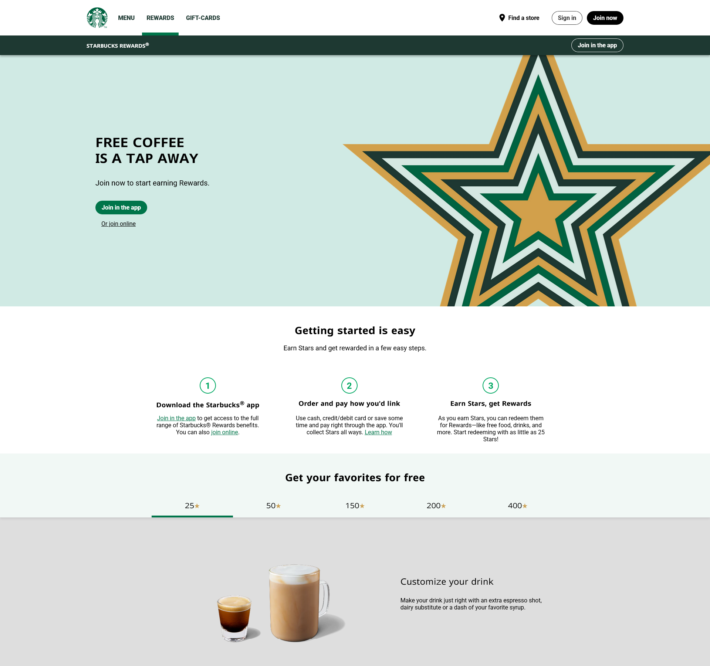
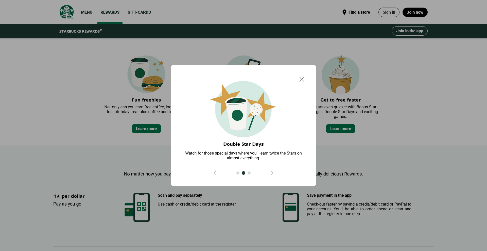
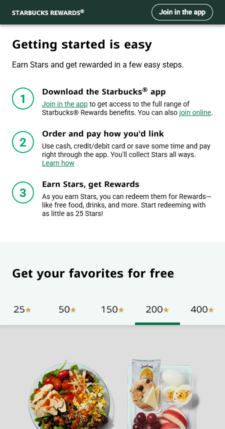
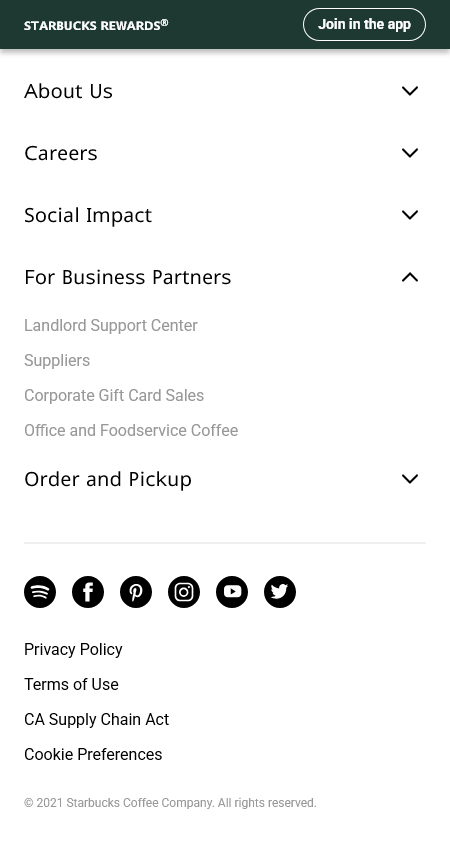
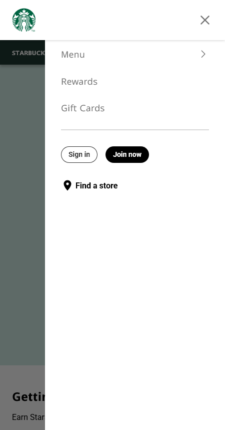
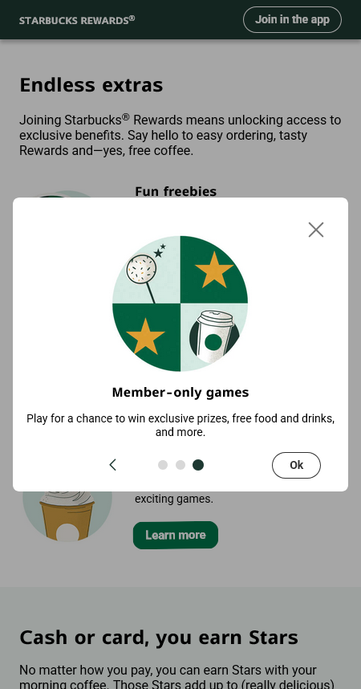

# Starbucks Rewards Page

[**Открыть онлайн**](https://try-again-later.github.io/Starbucks-Rewards-Page/)

Копия страницы с сайта Старбакса, созданная с помощью Nuxt 3 и SCSS. Страница адаптирована как под декстоп, так и под мобильные экраны.
Есть интерактивные элементы (бургерное меню на узких экранах, модалки, раскрывающиеся списки). На странице полностью работает клавиатурная навигация.

---

[**Live version**](https://try-again-later.github.io/Starbucks-Rewards-Page/)

A copy of the "Rewards" page from the Starbucks website made with Nuxt 3 and SCSS. The page is adapted both for desktop and mobile screens.
There are some interactive elements present on the page (such as a burger menu on small screens, modal windows and dropdown lists).
The page is fully navigable using a keyboard.

## Run locally

```sh
npm install
npm run dev
```

The app will be available at [localhost:3000](http://localhost:3000/).

## Screenshots





   
